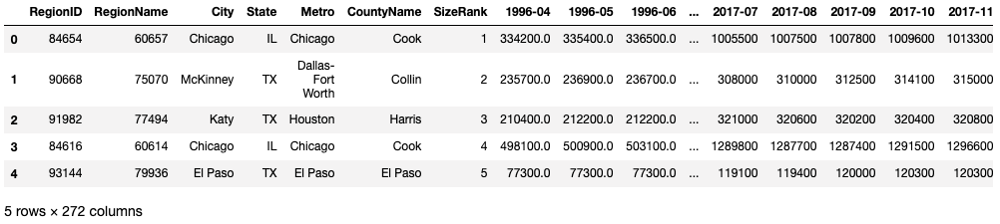
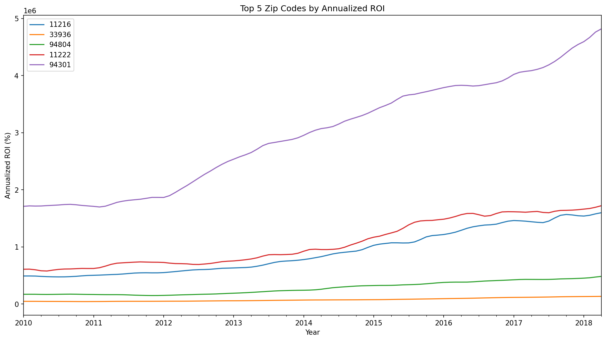
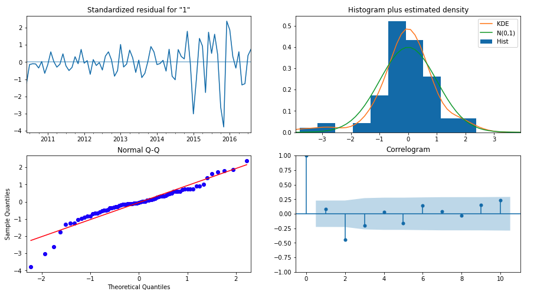
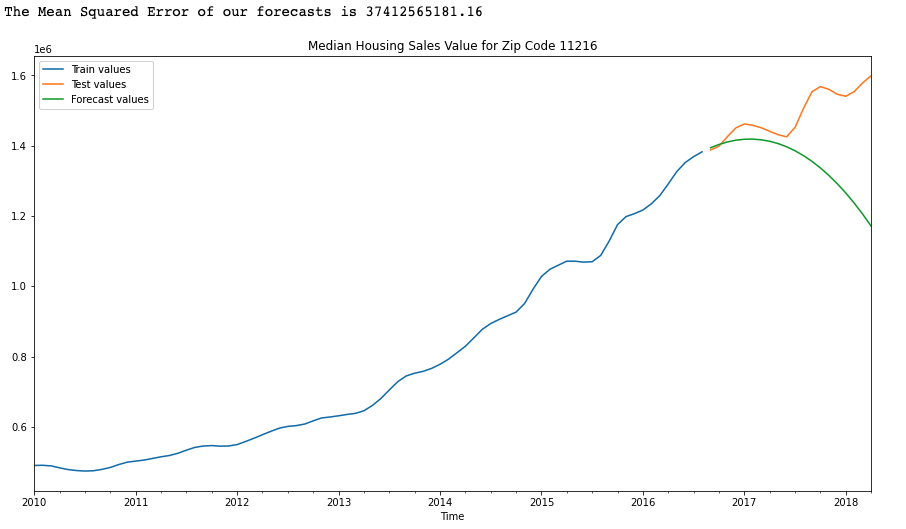
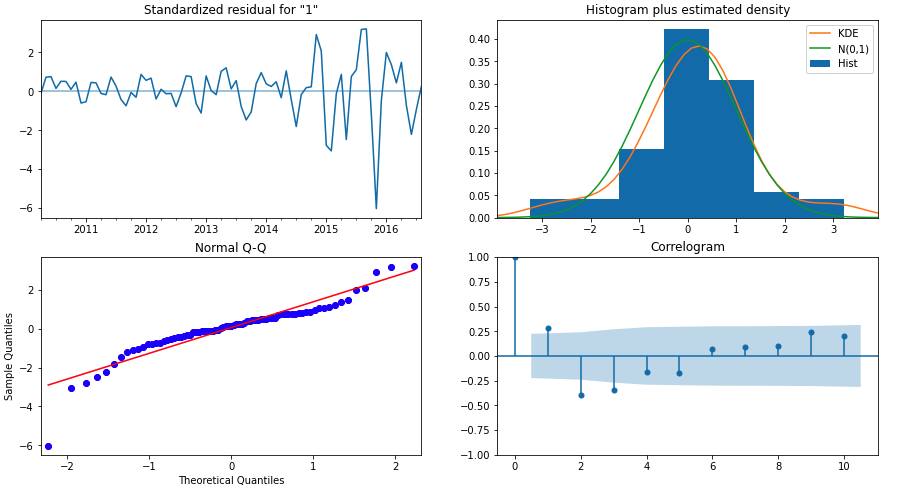
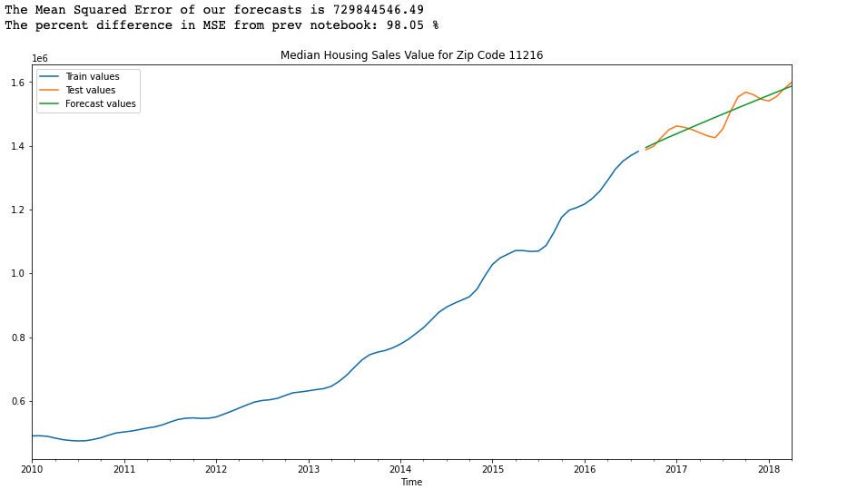
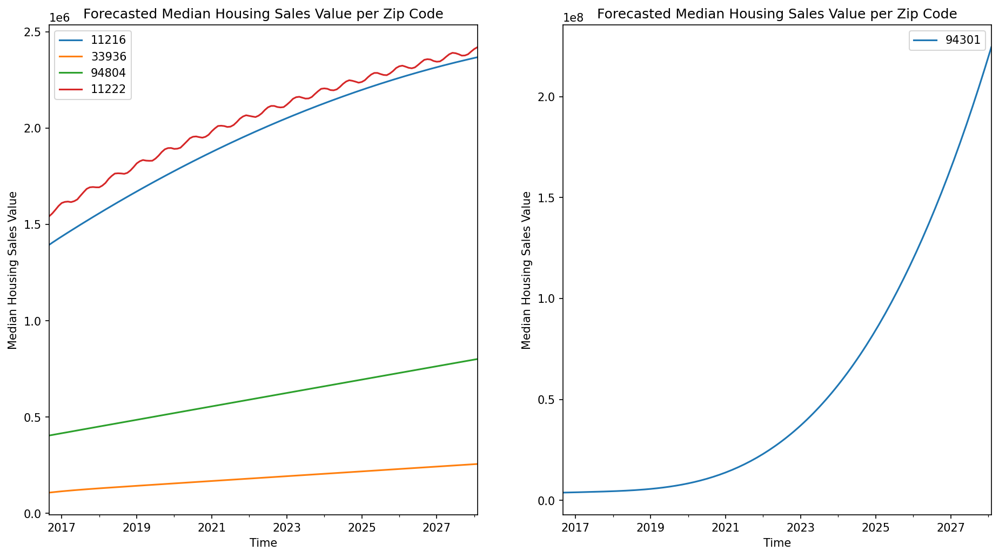

# Zillow Time Series Modelling

## Author: [Patricio Contreras](https://www.linkedin.com/in/pcontreras97/)

## Overview

This project is concerned in determining the best zipcodes to invest in real-estate.  Given time series data from Zillow, we'll investigate how the median housing sales value per zipcode changes over time.  Once initial exploration of the data is performed, time series models will be constructed and optimised for forecasting.  By the end of this project, anyone interested in investing should have a clear idea on which places are vital and which places to avoid.

## Business Problem

The Bluth Company, a real-estate investment firm based in Orange County, CA, wishes to expand and invest in properties all across the country.  Unversed in real-estate in other counties and states, they ask the following question:

- What are the top 5 best zip codes to invest in?

While this question may seem straightforward at first, how do we define "best"?  Given the Zillow data, which contains 14,723 zip codes, is it a matter of sorting by the most recent month?  How do we account for fluctuations over time?  Should we focus more on profit margins?  What about risk?

## The Data

The data used for this project was obtained from [Zillow Research](https://www.zillow.com/research/data/).  It contains information on median housing sales value (per zipcode) from April 1996 to April 2018 for 14,723 zip codes.  The csv file can be found in the folder [data](data).  A preview of the data is below:

## Methods

The business problem we have at hand asks what are the best zip codes to invest in **today**.  In other words, what are the zip codes that will most likely yield the greatest return?  Even though historical data from 1996 provides context and allows anyone to see how the zip code's value increased over time, a potential investor will most likely be interested in the zip code's _future_ value than its value 22 years ago.  In order to produce reliable and good forecasts, our time series models should really focus more on recent data.  For example, external factors, like the 2008 stock market crash, can affect the accuracy and reliability of our forecasts.

Given the nature of the business problem and the historical context, only **data from 2010 onwards will be considered** and any rows with missing data will also be excluded.  

After filtering the data, annualized return on investment (ROI) was calculated as a way to compare one zip code with another.  This metric, normally used to measure the efficiency or profitability of an investment, allows us to sort the data and pick the top 5 best performing zip codes.

The top 5 zip codes in terms of annualized ROI can be seen below:

## Time Series Model - ARIMA

As seen by the plot above, the 5 time series were _not_ stationary.  Furthermore, there is no apparent seasonality component.  Therefore, Autoregressive Integrated Moving Average (ARIMA) models were used to fit the data.  An 80-20 train/test split was performed to measure each model's performance on unseen data.

### Choosing the Right Parameter Values - AIC

Finding the optimal values for `p`, `d`, and `q` can be challenging and there are many ways to go about this.  This project used an exhaustive "grid search" method whereby we define a parameter grid, fit an ARIMA model for every possible combination of `p`, `d`, and `q`, and record the model's Akaike Information Criterion (AIC) score.  After each ARIMA model is fitted, the parameter values chosen for each model are the ones that result with the lowest AIC score.

### Residual Diagnostics and In-Sample Forecasting

Having obtained our initial "optimal" parameter values, we fitted an ARIMA model to the training data and inspected the model's summary, residual diagnostics, and calculated the model's MSE along with the forecast plot.  An example is shown below:

## ARIMA Model Tuning

An important takeaway from the ARIMA [notebook](ARIMA.ipynb) is that the model with the lowest AIC won't always have the best testing mean squared error (MSE).  The difference between the forecasted values and test values was large and model tuning was definitely needed.

### Parameter Selection - MSE

Still using the exhaustive grid search method, we fit each model and recorded its test MSE.  Once all models have been fitted, we selected the model with the lowest MSE for each zip code.

### Residual Diagnostics and In-Sample Forecasting

Having used a different metric to select the parameter values for `p`, `d`, and `q`, the results for each model improved.  Residuals were mostly centred around 0, had relatively constant variance, and most of their distributions resembled a standard normal.  Furthermore, forecasting also improved as the predicted values were closer to the testing data, shrinking the MSE.  An example is shown below:

## Producing and Visualising Out-of-Sample Forecasts

I decided to plot two graphs instead of one since zip code 94301 is on a completely different scale than all other zip codes.

It is clear that all zip codes will still increase in value over time, however, the rate for zip codes 11222 and 11216 seems to go down over the years.  In contrast, the value for zip code 94301 is predicted to skyrocket in the mid 2020s.  Keep in mind, as we predict further and further into the future, our confidence intervals will also widen.  This is because we're less confident in our predictions as opposed to in the near future.

## Limitations and Recommendations

Even though the ARIMA models produced relatively good predictions when compared to the test data and gave some insight as to what could happen in the future, there are some areas for improvement.  For example:

- when selecting `p`, `d`, and `q`, a parameter grid with a range of values from 0 to 5 was used.  By setting a limit of 5, we potentially miss out on other models that could lower the MSE even more

- residual diagnostics could be improved.  Not all models had the best residual diagnostics.  Even though using MSE improved residual distributions in some cases, other models could use some further parameter tweaking to improve results

- Annualized ROI: even though this is a popular metric used to evaluate the profitability of an investment, perhaps another metric could be used to select other 5 zip codes

- Gather more recent data and analyse the effect the COVID-19 pandemic had on median housing sales values for each zip code

- Consider more factors than just median housing sales value.  School district, household income, and location greatly affect the value

## For More Information

To see the full analysis, check out [EDA](EDA.ipynb).  For a more concise presentation, take a look at this [presentation](presentation.pdf).